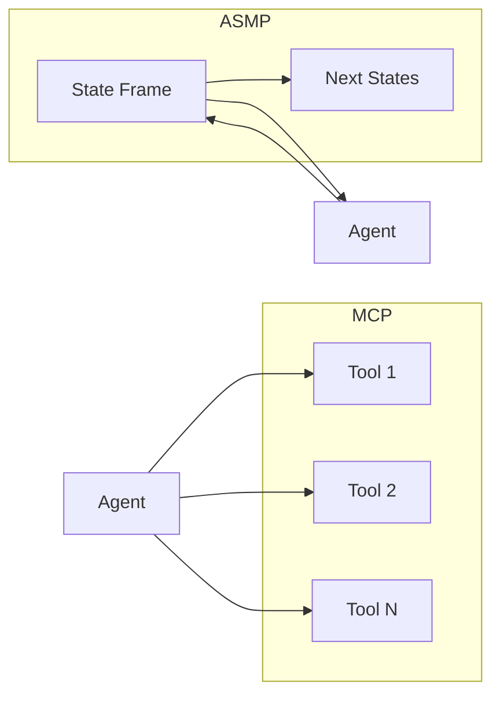

# Agent State Machine Protocol (ASMP)

**ASMP is a lean, agent-native replacement for MCP.** While MCP treats agents as "tool-callers" with a static menu of capabilities, ASMP treats them as **process executors** navigating a **Finite State Machine (FSM)**. The server exposes only the context that matters for the current step—a **State Frame**—so agents stay token-efficient and deterministic.



---

## Why ASMP?

| | **MCP (legacy)** | **ASMP (agent-native)** |
|---|------------------|-------------------------|
| **Token usage** | High: loads all tool schemas up front | **Minimal**: only current state + one skill |
| **Control** | Probabilistic: agent guesses next step | **Deterministic**: server enforces valid paths |
| **Logic** | Scattered in prompt/client | **Centralized** in FSM + SKILL.md + stage tools/resources |
| **Async** | Request-response; long tasks time out | **Async-first**: Streamable HTTP / NDJSON |
| **Integration** | Requires MCP SDKs/servers | **Zero-package**: standard HTTP + JSON |

**ASMP is the GPS.** The server tells the agent: *You are here; these are the only valid next actions.*

→ **[Full documentation](docs/README.md)** — detailed docs for every feature below. **[Contributing](CONTRIBUTING.md)** — how to run tests and keep the spec in sync.

---

## The State Frame

→ **[State Frame (detailed)](docs/state-frame.md)**

Every ASMP response is a **State Frame**—the single source of truth for the run:

| Field | Purpose |
|-------|--------|
| `run_id` | Unique execution instance; used for resumption and stream |
| `workflow_id` | Workflow blueprint (e.g. `document-approval-v1`) |
| `state` | Current FSM node (e.g. `AWAITING_AUDIT`) |
| `status` | `active` \| `processing` \| `awaiting_input` \| `completed` \| `failed` |
| `hint` | Natural language guidance for the LLM (system-prompt bridge) |
| `active_skill` | Optional link to a SKILL.md; load only in this state |
| `next_states` | Valid transitions: `action`, `method`, `href`, `expects` |
| `stream_url` | Where to listen for NDJSON state updates |
| `tools` | Optional. Stage-bound tools callable in this state (name, href, description, expects). |
| `resources` | Optional. Stage-bound resources readable in this state (uri, name, mime_type). |

**Progressive disclosure:** Only the current state and its `next_states` (and that state’s `tools` / `resources`) are exposed. No global tool menu.

---

## Dynamic CLIs (remote dynamic CLI feature)

ASMP supports a **remote dynamic CLI** feature: every server exposes **`GET /runs/{run_id}/cli`**, which returns a CLI object (prompt, hint, options) for the current state—either from workflow **hooks** (`.cli(state, ...)`) or **auto-generated** from the frame’s hint and next_states. So any client can use any ASMP server as a CLI tool.

**[CLRUN](https://github.com/cybertheory/clrun)** (npm: [clrun](https://www.npmjs.com/package/clrun)) supports dynamic remote CLIs via ASMP: connect to an ASMP server and drive the flow from the terminal. Example:

```bash
# Connect to an ASMP server (Node)
npx clrun asmp http://localhost:8000

# Or install globally first
npm install -g clrun
clrun asmp http://localhost:8010
```

Then use `clrun <id> "1"` or `clrun <id> "<action_name>"` to send options; `clrun tail <id> --lines 50` to view output. CLRUN fetches the CLI endpoint after every state update and drives the flow in its virtual terminal. See **[Dynamic CLI (detailed)](docs/dynamic-cli.md)**.

---

## Stage Integrations (Tools & Resources)

Where does **integration/tool/resource logic** run? In ASMP it lives in **stage-bound handlers** you register on the workflow—similar in spirit to MCP tools and resources, but scoped by the FSM.

- **Tools**: Callable in a state. The agent `POST`s to the tool’s `href` with an optional body; the server runs the **handler** you registered for that state and tool, and returns `{ result }`. Only valid when the current state lists that tool in `tools`.
- **Resources**: Read-only content in a state. The agent `GET`s a resource `uri`; the server runs the **handler** you registered for that state and path, and returns the content. Only valid when the state lists that resource in `resources`.

**Where logic lives**: Handlers are registered per state (e.g. `workflow.tool("STATE", "name", handler)` and `workflow.resource("STATE", path, handler)`). The server executes the right handler only when the run is in that state—no execution outside the FSM.

**DX example (Python):**

```python
def run_linter(run_id: str, run_record: dict, body: dict):
    paths = body.get("paths", [])
    # ... run linter, return pass/fail and issue count
    return {"passed": True, "issues": 0}

workflow = (
    ASMPWorkflow("my-wf", "INIT", transitions)
    .hint("LINT", "Run the linter, then transition with lint_done.")
    .tool("LINT", "run_linter", run_linter, description="Run linter", expects={"paths": "array"})
)
```

**DX example (TypeScript):**

```typescript
workflow
  .hint("LINT", "Run the linter, then transition with lint_done.")
  .tool("LINT", "run_linter", async (run_id, r, body) => {
    const paths = (body?.paths as string[]) ?? [];
    // ... run linter
    return { passed: true, issues: 0 };
  }, { description: "Run linter", expects: { paths: "array" } });
```

---

## Agent Skills

ASMP integrates with the [Open Agent Skill](https://cursor.com/docs/agents/skills) spec. When a State Frame includes `active_skill`, the client:

1. Fetches the skill from `active_skill.url` (e.g. a SKILL.md).
2. Injects its content into the LLM system message or history.

Skills are **just-in-time**: only the skill for the current state is loaded, keeping context minimal.

→ **[Agent skills (detailed)](docs/agent-skills.md)**

---

## Async-first: Streamable HTTP

→ **[Streamable HTTP (detailed)](docs/streaming.md)**

Long-running steps use **NDJSON** (Newline-Delimited JSON) over a single HTTP connection:

- **GET** `stream_url` with `Accept: application/x-ndjson` to receive State Frames as they change.
- Optional **Unified Endpoint**: a **POST** to a transition can return **202 Accepted** and immediately stream NDJSON on the same connection.

No polling; the server pushes updates. Resumption is supported via `Mcp-Session-Id` and `Last-Event-ID`. **First-class Redis:** pass a Redis URL (`redis_url` in Python, `redisUrl` in TypeScript) and the SDK publishes every run update and streams via Redis—see [Streamable HTTP (Redis)](docs/streaming.md#first-class-redis-streaming-python-and-typescript).

---

## Quickstart

→ **[Quickstart (detailed)](docs/quickstart.md)**

### Python (FastAPI)

```bash
cd sdks/python && pip install -e . && pip install uvicorn
```

```python
from asmp import ASMPWorkflow, TransitionDef, create_app

transitions = [
    TransitionDef(from_state="INIT", action="start", to_state="DONE"),
]
workflow = ASMPWorkflow("my-wf", "INIT", transitions).hint("INIT", "Start here.")
app = create_app(workflow)
# Run: uvicorn app:app --reload
```

### TypeScript (Hono)

```bash
cd sdks/typescript && npm install && npm run build
```

```typescript
import { createApp, ASMPWorkflow } from "./src/index.js";

const transitions = [{ from_state: "INIT", action: "start", to_state: "DONE" }];
const workflow = new ASMPWorkflow("my-wf", "INIT", transitions).hint("INIT", "Start here.");
const app = createApp(workflow);
// Serve with @hono/node-server or your adapter
```

### Client (any language)

```bash
# Start a run
curl -X POST http://localhost:8000/runs -H "Content-Type: application/json" -d '{"data":{}}'

# Get current frame
curl http://localhost:8000/runs/<run_id>

# Trigger transition
curl -X POST http://localhost:8000/runs/<run_id>/transitions/start -H "Content-Type: application/json" -d '{}'
```

---

## Server without Hono (TypeScript)

→ **[Server fetch handler (detailed)](docs/server-fetch-handler.md)**

The FSM, transitions, tools, resources, and **streamable HTTP (NDJSON)** run with **no Hono dependency**. Use `createFetchHandler` on Cloudflare Workers, Supabase Edge Functions, Convex HTTP, or any `fetch`-based runtime:

```typescript
import { createFetchHandler, ASMPWorkflow, InMemoryStore } from "asmp-sdk";

const workflow = new ASMPWorkflow("my-wf", "INIT", transitions, "https://your-worker.workers.dev")
  .hint("INIT", "Start").hint("DONE", "Done");
const store = new InMemoryStore();
const handle = createFetchHandler(workflow, store, { basePath: "/api/asmp" }); // optional basePath

// Workers: export default { fetch: handle };
// Supabase/Convex: use handle(req) as your HTTP handler.
```

Same protocol (discovery, runs, transitions, invoke, resources, GET stream). Streams use standard `ReadableStream`, so NDJSON works in all these environments.

---

## Client-side local FSM (TypeScript)

→ **[Client-side local FSM (detailed)](docs/client-local-fsm.md)**

Clients can run an **in-memory FSM** with no server. Use one or many backends in parallel (local + remote):

```typescript
import { ASMPClient, LocalASMPBackend, ASMPWorkflow } from "asmp-sdk";

const workflow = new ASMPWorkflow("local-wf", "INIT", transitions, "memory:")
  .hint("INIT", "Start").tool("LINT", "run_lint", (id, rec, body) => ({ passed: true }));

const localBackend = new LocalASMPBackend(workflow, {});
const client = new ASMPClient(localBackend);  // or new ASMPClient("https://api.example.com") for HTTP

const frame = await client.startRun();
await client.transition("start");
const result = await client.invokeTool("run_lint", {});
for await (const chunk of client.stream()) { /* NDJSON frames */ }
```

Use **multiple clients** in parallel: e.g. `new ASMPClient(remoteBackend)` and `new ASMPClient(localBackend)` so the agent can drive both a remote workflow and a local one.

---

## Client discovery config (JSON, MCP-style)

→ **[Client discovery (detailed)](docs/client-discovery.md)**

Servers are defined in a **JSON config** (from file or agent context). **Local FSMs** (in-memory, no server) are **not** in the config—they are supplied only in code.

**Two different things:**

| | **Server (HTTP)** | **Local FSM (embedded)** |
|---|-------------------|---------------------------|
| What | ASMP server at a URL (remote or `http://localhost:PORT`) | In-memory workflow + store; no server process |
| In config? | Yes: `servers[].base_url` | No—programmatic only |
| Add at runtime | `registry.addServer(id, baseUrl)` | `registry.addLocalFsm(id, LocalASMPBackend(...))` |
| `listServers()[].type` | `"http"` | `"embedded"` |

**Config shape** (see `spec/CLIENT_CONFIG.json`):

```json
{
  "servers": [
    { "id": "legal-review", "base_url": "https://api.example.com/legal" },
    { "id": "ci-cd", "base_url": "http://localhost:3000" }
  ]
}
```

Use **`ASMPClientRegistry`** to load this config and obtain clients by id. Add **in-memory FSMs** with `localFsms` / `addLocalFsm`. The agent can **dynamically add** server URLs (e.g. from a skill or CLI):

```typescript
import { ASMPClientRegistry, LocalASMPBackend, ASMPWorkflow } from "asmp-sdk";

const registry = new ASMPClientRegistry({
  config: jsonConfigOrString,           // servers (remote or localhost)
  localFsms: {                          // in-memory FSMs only; no server
    myFsm: new LocalASMPBackend(workflow, {}),
  },
});

registry.listServers();  // [{ id, type: 'http'|'embedded', base_url? }, ...]
registry.addServer("cli-run", "http://localhost:4000");  // dynamic server URL

const client = registry.getClient("legal-review");
await client.startRun();
```

---

## Repository layout

| Path | Description |
|------|-------------|
| `docs/` | **Detailed docs** for every feature: [docs/README.md](docs/README.md) |
| `spec/` | PROTOCOL.md, STATE_FRAME.json, CLIENT_CONFIG.json, STAGE_INTEGRATIONS.md, SKILL_INTEGRATION.md |
| `sdks/python/` | FastAPI server, Pydantic models, ASMPClient, LLM wrapper, visualizer |
| `sdks/typescript/` | Hono server, Zod models, ASMPClient, LLM wrapper, visualizer |
| `skills/` | Example Agent Skills (SKILL.md) for audit, upload, approval, lint |
| `examples/` | legal-review-flow (Python), ci-cd-bot (TypeScript) |
| `tests/` | Python (pytest) in `tests/python/`; TypeScript (Vitest) in `sdks/typescript/tests/` |
| `scripts/` | `check_openapi_sync.py` — verifies Python OpenAPI copy matches spec |

**Agent integration tests:** Optional tests run a small AI agent (OpenAI mini) that uses the ASMP client to drive a workflow. They are skipped unless `OPENAI_API_KEY` is set. Run them with:
- **Python:** `pip install -e ".[dev]"` (includes `openai`), then `OPENAI_API_KEY=sk-... pytest tests/python/test_agent_asmp.py -v`
- **TypeScript:** `OPENAI_API_KEY=sk-... npm test` (in `sdks/typescript`; the agent test is skipped when the key is missing).

**OpenAPI single source:** The canonical API spec is **`spec/openapi.json`**. When you change the API, update that file first; then sync the Python copy (`cp spec/openapi.json sdks/python/asmp/openapi.json`) and the TypeScript server’s `sdks/typescript/src/openapi-spec.ts`. Run **`python scripts/check_openapi_sync.py`** to verify the Python copy matches the spec (use in CI to enforce sync).

**SDK conventions:** Python uses **snake_case** for method and parameter names (e.g. `run_id`, `get_frame`, `start_run`); TypeScript uses **camelCase** (e.g. `runId`, `getFrame`, `startRun`). Same protocol, different style per language.

---

## Visualizer

→ **[Visualizer (detailed)](docs/visualizer.md)**

Both SDKs expose a **Mermaid.js** FSM diagram:

- **Python**: `GET /visualize?run_id=<id>` (optional highlight of current state).
- **TypeScript**: `GET /visualize?run_id=<id>`.

Use it to debug runs and share workflow structure.

---

## License

MIT.
